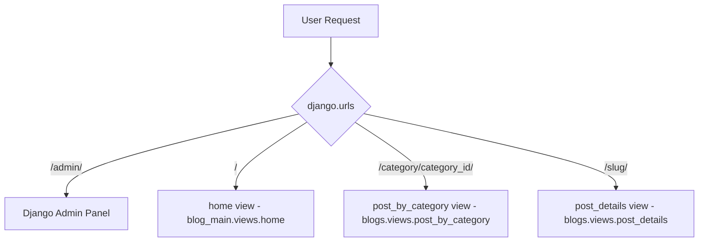

# Post Craft - Granular Project Analysis

This document provides a comprehensive, granular-level architectural analysis of the **Post Craft** blogging application. It highlights the technology stack, project structure, data models, routing flows, context variables, and a granular function-by-function breakdown showing exactly what each function does, what parameters it accepts, and where its rendered data ends up.

---

## 1. Project Overview & Architecture
Post Craft is a modern, dark-themed blogging application built on **Django 6.0.3** and **Bootstrap 5.3.3**.

### Directory Structure
```text
Post Craft/
│
├── blog_main/                 # Project configuration directory
│   ├── static/                # Static assets (custom css)
│   ├── settings.py            # Global Django settings
│   ├── urls.py                # Root URL routing configuration
│   ├── views.py               # View controllers for main layout (home view)
│   └── wsgi.py / asgi.py      # WSGI/ASGI application entrypoints
│
├── blogs/                     # Primary app for blog post features
│   ├── templatetags/          # Custom Django template tags
│   │   └── custom_filters.py  # Custom filters (exact_naturaltime)
│   ├── admin.py               # Django Admin customization
│   ├── context_processors.py  # Injects categories into all templates
│   ├── models.py              # Database Schema (Category, Blog)
│   ├── urls.py                # Feature-specific URL routing
│   └── views.py               # View controllers for posts & categories
│
├── templates/                 # Global HTML templates
│   ├── 404.html               # 404 Error fallback page
│   ├── base.html              # Main parent layout template
│   ├── home.html              # Homepage layout
│   ├── post.html              # Blog post detail page
│   └── posts_by_category.html # Category filter page
│
├── db.sqlite3                 # Local SQLite database
└── manage.py                  # Django CLI administrative utility
```

---

## 2. Database Models (`blogs/models.py`)

### 1. `Category`
Represents a classification category for organizing blog posts.
*   **Fields**:
    *   `category_name` (`CharField`, max_length=100): The display name of the category (e.g., "Sports", "Science").
    *   `created_at` (`DateTimeField`, auto_now_add=True): Timestamp of when the category was created.
    *   `updated_at` (`DateTimeField`, auto_now=True): Timestamp of when the category was last modified.
*   **Methods**:
    *   `__str__(self)`: Returns the string representation of the model (`self.category_name`).

### 2. `Blog`
Represents an individual blog post.
*   **Fields**:
    *   `title` (`CharField`, max_length=200): The title of the post.
    *   `slug` (`SlugField`, max_length=200, unique=True): URL-friendly string identifier generated from the title.
    *   `category` (`ForeignKey` to `Category`, `on_delete=models.CASCADE`): The category this blog post belongs to.
    *   `author` (`ForeignKey` to Django `User` model, `on_delete=models.CASCADE`): The user who authored the post.
    *   `featured_image` (`ImageField`, upload_to='uploads/%Y/%m/%d/'): Image banner uploaded for the post.
    *   `description` (`TextField`): Short summary or teaser of the blog post.
    *   `content` (`TextField`, max_length=2000): The full body content of the blog post.
    *   `status` (`IntegerField` with choices `Draft = 0`, `Published = 1`): Controls whether the post is visible online.
    *   `is_featured` (`BooleanField`, default=False): Flag indicating whether the post is highlighted in the "Featured" sections on the homepage.
    *   `created_at` (`DateTimeField`, auto_now_add=True): Timestamp of when the post was created.
    *   `updated_at` (`DateTimeField`, auto_now=True): Timestamp of when the post was last modified.
*   **Methods**:
    *   `__str__(self)`: Returns the string representation of the model (`self.title`).

---

## 3. URL Routing Layout



---

## 4. Granular Function & Controller Analysis

Here is the exact description of every custom Python function in the application, including its parameters, database queries, and where its rendered data goes.

### 1. `get_categories`
*   **Location**: `blogs/context_processors.py`
*   **Parameters**:
    *   `request` (`HttpRequest`): The standard Django request object.
*   **Database Queries**:
    *   `Category.objects.all()`: Fetches all categories registered in the database.
*   **Returned Context Dictionary**:
    ```python
    {'categories': categories}
    ```
*   **Where Rendered Data Goes**:
    Registered globally in `settings.py` under the `TEMPLATES` configuration list. Its output is automatically injected into **all** rendered templates using a `RequestContext`.
    *   **In Template**: Extensively used in [`templates/base.html`](file:///e:/Post%20Craft/templates/base.html#L41-L43) to dynamically build the horizontal category navigation bar:
        ```html
        
          <a href="">{{ category.category_name }}</a>
        
        ```

---

### 2. `exact_naturaltime`
*   **Location**: `blogs/templatetags/custom_filters.py` (Registered custom template filter: `@register.filter`)
*   **Parameters**:
    *   `value` (`datetime`): A database timestamp value (e.g., `blog.created_at`).
*   **Logic Breakdown**:
    1. Converts the timestamp into a standard human-friendly string using Django's built-in `naturaltime` filter (e.g., `2 days, 3 hours ago`).
    2. Checks if there is a comma (`,`) in the output string.
    3. If a comma exists (which happens when there are secondary divisions like `hours` alongside `days`), it splits the string at the comma and strips the trailing details, appending `' ago'` if applicable.
    4. **Example Transformation**: `"2 days, 2 hours ago"` $\rightarrow$ `"2 days ago"`.
*   **Where Rendered Data Goes**:
    It is imported into any template using ``.
    *   **In Templates**: Used in `home.html`, `post.html`, and `posts_by_category.html` directly on dates:
        ```html
        {{ blog.created_at|exact_naturaltime }}
        ```
        This renders as a clean, rounded human-friendly duration timestamp.

---

### 3. `home`
*   **Location**: `blog_main/views.py`
*   **Parameters**:
    *   `request` (`HttpRequest`): The standard incoming HTTP request object.
*   **Database Queries**:
    1.  `Category.objects.all()`: Fetches all categories (redundant with the context processor).
    2.  `Blog.objects.filter(is_featured=True).order_by('-created_at')`: Fetches all featured posts, sorted by newest first.
    3.  `Blog.objects.filter(is_featured=False, status=1).order_by('-created_at')`: Fetches all published, non-featured posts, sorted by newest first.
*   **Returned Context Dictionary**:
    ```python
    {
        'categories': categories,
        'featured_blogs': featured_blogs,
        'posts': posts,
    }
    ```
*   **Where Rendered Data Goes**:
    Passed to `render(request, 'home.html', context)`.
    *   **In Template (`home.html`)**:
        *   `featured_blogs[0]` (using `forloop.first`) is rendered in the large, immersive **Hero Banner** at the top of the homepage.
        *   `featured_blogs[1:3]` (sliced in template as `featured_blogs|slice:"1:3"`) are rendered in the secondary grid labeled **Featured section**.
        *   `posts` (non-featured published posts) are rendered under the **More Articles** header in a clean vertical list.
        *   `featured_blogs[3:]` (sliced in template as `featured_blogs|slice:"3:"`) are rendered in the right sidebar under **More featured articles**.

---

### 4. `post_by_category`
*   **Location**: `blogs/views.py`
*   **Parameters**:
    *   `request` (`HttpRequest`): The standard HTTP request object.
    *   `category_id` (`int`): The database integer ID of the category being clicked/filtered.
*   **Database Queries**:
    1.  `Blog.objects.filter(category_id=category_id, status=1)`: Fetches all published blog posts belonging strictly to the specified category ID.
    2.  `Category.objects.get(pk=category_id)`: Attempts to fetch the specific category name and details.
*   **Error Handling**:
    If the requested `category_id` does not exist in the database, it catches `Category.DoesNotExist` and serves [`templates/404.html`](file:///e:/Post%20Craft/templates/404.html) instead.
*   **Returned Context Dictionary**:
    ```python
    {
        'posts': posts,
        'Category': category,
    }
    ```
*   **Where Rendered Data Goes**:
    Passed to `render(request, 'posts_by_category.html', context)`.
    *   **In Template (`posts_by_category.html`)**:
        *   `Category.category_name` is rendered as the main header: `CATEGORY - SPORTS`.
        *   `posts` lists all articles corresponding to that category. If no articles exist, the template displays: *"No posts found in this category."*

---

### 5. `post_details`
*   **Location**: `blogs/views.py`
*   **Parameters**:
    *   `request` (`HttpRequest`): The standard HTTP request object.
    *   `slug` (`str`): The unique slug identifier for the post.
*   **Database Queries**:
    *   `get_object_or_404(Blog, slug=slug, status=1)`: Fetches the post with the corresponding slug that is in *Published* (`status=1`) status. If no match is found, it automatically raises a 404 HTTP exception.
*   **Returned Context Dictionary**:
    ```python
    {'post': post}
    ```
*   **Where Rendered Data Goes**:
    Passed to `render(request, 'post.html', context)`.
    *   **In Template (`post.html`)**:
        *   Renders the main article title, author metadata, category badge, large clean header image (`post.featured_image.url`), and the full body content (`post.description|safe|linebreaks`).

---

## 5. Summary Flow of Context Variables
| Context Variable Name | Supplied By | Available In | Render Location |
| :--- | :--- | :--- | :--- |
| **`categories`** | `blogs/context_processors.py` (and homepage view) | **All Templates** (Global) | Custom navbar in [`base.html`](file:///e:/Post%20Craft/templates/base.html) |
| **`featured_blogs`** | `home` view (`blog_main/views.py`) | `home.html` only | Hero banner, grid, and sidebar lists in [`home.html`](file:///e:/Post%20Craft/templates/home.html) |
| **`posts`** | `home` view & `post_by_category` view | `home.html` or `posts_by_category.html` | Content list in [`home.html`](file:///e:/Post%20Craft/templates/home.html) and [`posts_by_category.html`](file:///e:/Post%20Craft/templates/posts_by_category.html) |
| **`Category`** | `post_by_category` view (`blogs/views.py`) | `posts_by_category.html` only | Sub-header and page title |
| **`post`** | `post_details` view (`blogs/views.py`) | `post.html` only | Entire detailed blog page content |
